# Creating Echo Bot that uses DL ASE - 4th Attempt

## Steps

### *Grab Fresh clone of 02.echo-bot (js)*
<details>
    <summary>Cloning and Testing Echo Bot Locally</summary>

* `git clone https://github.com/microsoft/BotBuilder-Samples.git`
* Navigate to `02.echo-bot` (js)
* To make successful deployment super obvious, change `bot.js` to echo user's message + `'- 4th echo bot!'` appended
* `npm i` and `npm start` to run bot and ensure everything works locally in Emulator

</details>

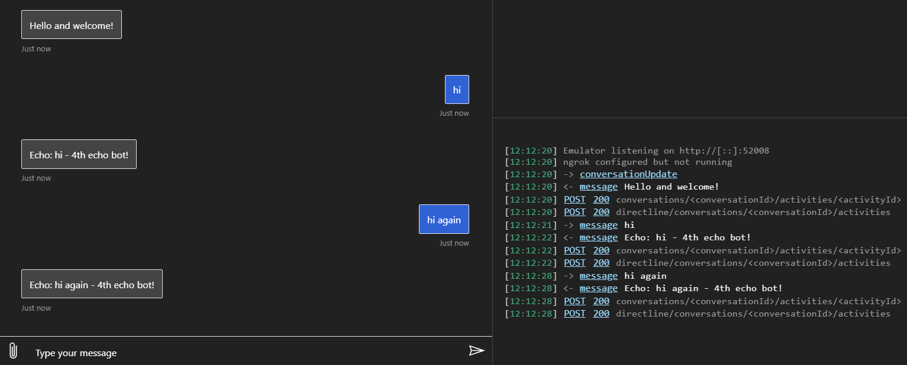

___

### *Deploy Echo Bot*
Throwing everything in a new resource group with brand new resources, just to completely rule out any interference from any of my other bots.

<details> 
    <summary>Deployment Steps</summary>

**Manually in Azure**

<details>
    <summary>Create Resource Group & App Service Plan</summary>

Due to some issues with az cli and zip deployment right now, **going to create some pieces manually** to deploy instead of just following instructions to the T in [Deploy your bot](https://docs.microsoft.com/en-us/azure/bot-service/bot-builder-deploy-az-cli?view=azure-bot-service-4.0&tabs=javascript) article
* **Resources for this 4th attempt will all be named `ash-streaming-echo-js4`**
* [Create resource group](https://ms.portal.azure.com/#create/Microsoft.ResourceGroup) (`westus2`)
* [Create Azure App Service Plan](https://ms.portal.azure.com/#create/Microsoft.AppServicePlanCreate) (`Windows`, `westus2`, `S1`)

</details>

**Using AZ CLI**
<details>
    <summary>Create App Registration, App Service, Bot Channels Registration. Prepare code for deployment. Deploy code to Azure.</summary>

* Create Azure Application Registration: `az ad app create --display-name "ash-streaming-echo-js4" --password "..." --available-to-other-tenants`

* Create App Service & Bot Channels Registration - with existing resource group and existing app service plan
    * `az deployment group create --resource-group "ash-streaming-echo-js4" --template-file "deploymentTemplates/template-with-preexisting-rg.json" --parameters appId="8c31f069-xxxx-xxxx-xxxx-xxxxxxxxb837" appSecret="..." botId="ash-streaming-echo-js4" newWebAppName="ash-streaming-echo-js4" newAppServicePlanName="ash-streaming-echo-js4" appServicePlanLocation="westus2" --name "ash-streaming-echo-js4"`

* Prepare code for deployment
    * Create `web.config`: `az bot prepare-deploy --code-dir "." --lang Javascript`
    * Zip code directory manually: 
        * 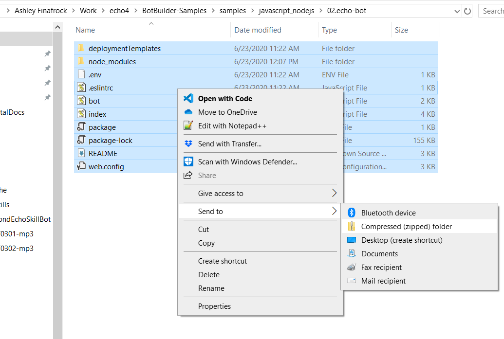

* Deploy code to Azure: `az webapp deployment source config-zip --resource-group "ash-streaming-echo-js4" --name "ash-streaming-echo-js4" --src "codes.zip"`


</details>

</details>


Verify Echo Bot deployed to Azure in Test in WebChat

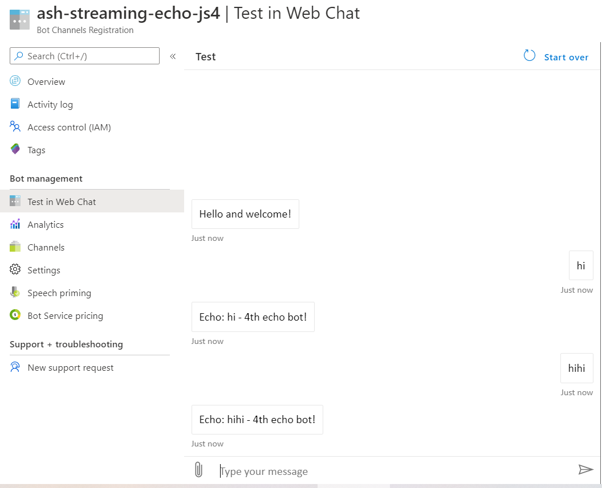

___

### *Follow Steps in [Configure Node.js bot for extension](https://docs.microsoft.com/en-us/azure/bot-service/bot-service-channel-directline-extension-node-bot?view=azure-bot-service-4.0)*

#### *Update Bot to use DL ASE*

Making changes locally, then pushing changes to Azure, to have better version control. Originally I was just editing everything directly in web editor in Azure, but got lost with how many tweaks I was making.

<details>
    <summary>Add useNamedPipe to index.js</summary>

* Add `BotFrameworkAdapter.useNamedPipe` method in `index.js`. This is after `/api/messages` and before `upgrade` listeners.
    * 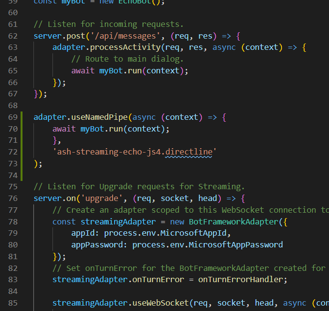

* <details>
    <summary>Change echo message, add credentials to .env, and deploy changes to Azure.</summary>

    * Appended "useNamePipe" to echo message that bot sends
    * Add appId and password to .env
    * Deploy changes (`az webapp deployment source config-zip --resource-group "ash-streaming-echo-js4" --name "ash-streaming-echo-js4" --src "codes.zip"`)

    * Verify changes deployed to Azure and the `useNamedPipe` piece in bot didn't break anything by testing in WebChat
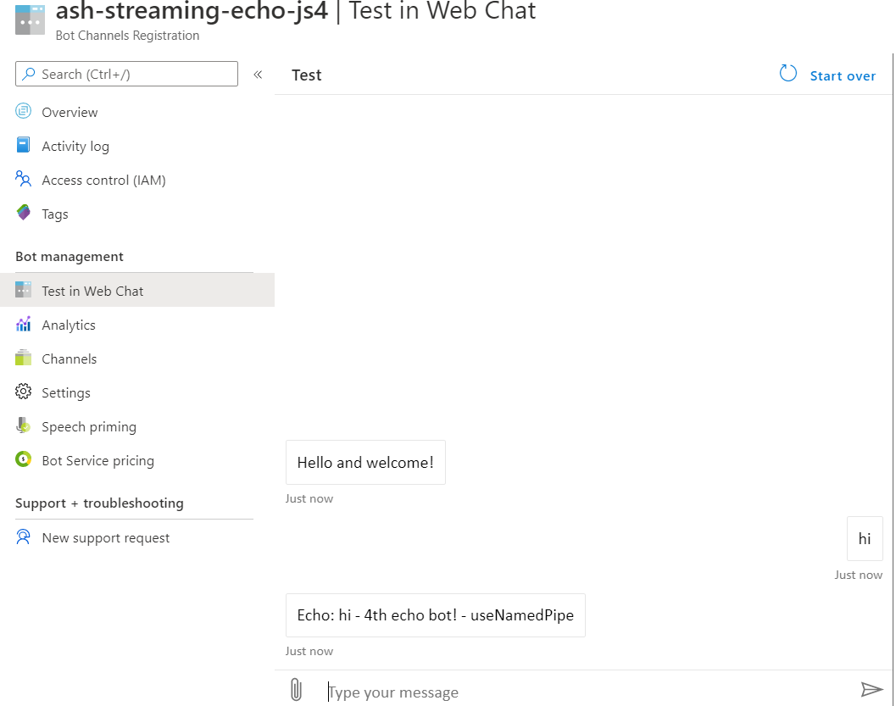

</details>


</details>


<details>
    <summary>Replace web.config contents with code snippet</summary>

* Replace web.config contents with following code snippet:
    ```xml
        <?xml version="1.0" encoding="utf-8"?>
        <configuration>
          <system.webServer>
            <handlers>      
              <add name="aspNetCore" path="*/.bot/*" verb="*" modules="AspNetCoreModule" resourceType="Unspecified" />
              <add name="iisnode" path="*" verb="*" modules="iisnode" />
            </handlers>
           </system.webServer>
        </configuration>    
    ```
    * After deploying the change in `web.config` to Azure, the bot now does not work in Test in WebChat. This is expected, as we still have not enabled DL ASE Azure App Service.
        * 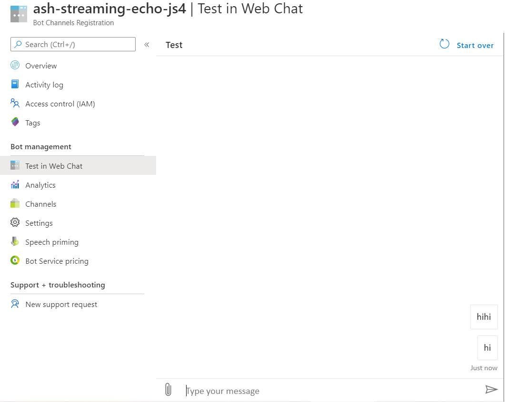

</details>

#### *Enable DL ASE in Azure*

<details>
    <summary>Grab DL ASE key in Bot Channels Registration</summary>

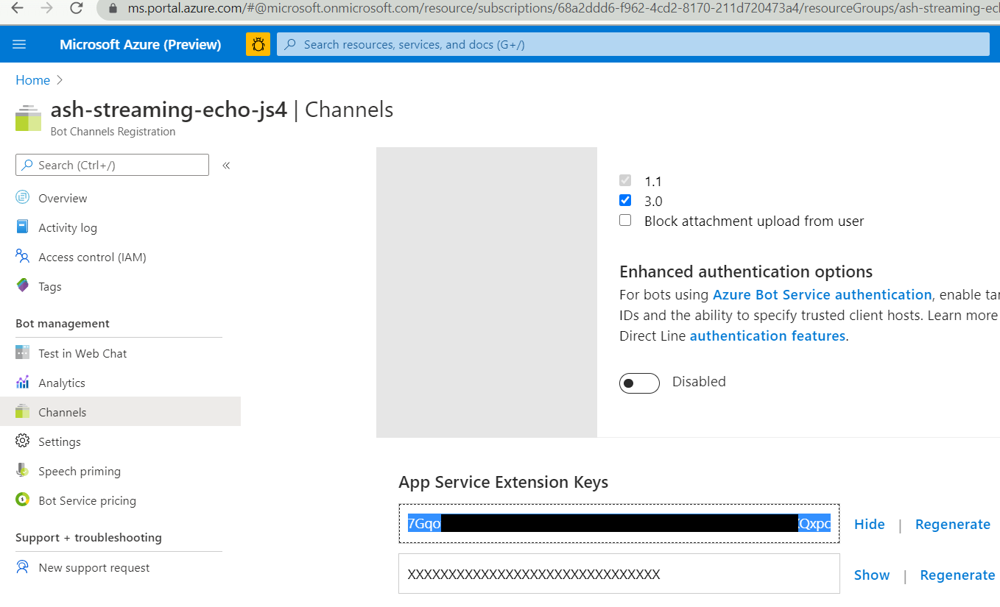
</details>

<details>
    <summary>Update App Service configuration and enable WebSockets</summary>

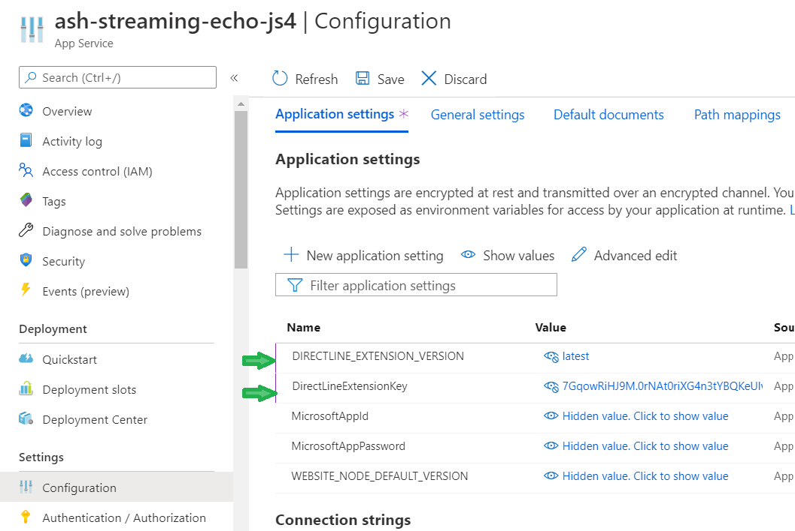
</details>

<details>
    <summary>Test DL ASE and the Bot are Initialized</summary>
    
Go to `https://ash-streaming-echo-js4.azurewebsites.net/.bot/`: 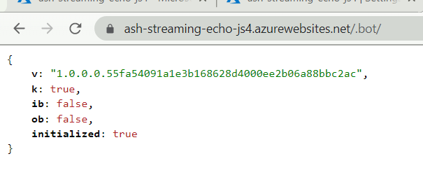

</details>

* **DL ASE JSON does return**, but `ib`/`ob` are `false` when we want them to be `true`
* **Bot does not respond in Test in WebChat still**, even with DL ASE enabled in both bot and App Service configuration

___

### *Reverting to Default `web.config`*
* Reverting to the `web.config` that gets created by default, we see bot responds in WebChat again:
    * <details>
        <summary>Default web.config</summary>
        
        ```xml
            <?xml version="1.0" encoding="utf-8"?>
            <!--
                 This configuration file is required if iisnode is used to run node processes behind
                 IIS or IIS Express.  For more information, visit:
            
                 https://github.com/tjanczuk/iisnode/blob/master/src/samples/configuration/web.config
            -->
            
            <configuration>
              <system.webServer>
                <!-- Visit http://blogs.msdn.com/b/windowsazure/archive/2013/11/14/introduction-to-websockets-on-windows-azure-web-sites.aspx for more information on WebSocket support -->
                <webSocket enabled="false" />
                <handlers>
                  <!-- Indicates that the server.js file is a node.js site to be handled by the iisnode module -->
                  <add name="iisnode" path="index.js" verb="*" modules="iisnode"/>
                </handlers>
                <rewrite>
                  <rules>
                    <!-- Do not interfere with requests for node-inspector debugging -->
                    <rule name="NodeInspector" patternSyntax="ECMAScript" stopProcessing="true">
                      <match url="^index.js\/debug[\/]?" />
                    </rule>
            
                    <!-- First we consider whether the incoming URL matches a physical file in the /public folder -->
                    <rule name="StaticContent">
                      <action type="Rewrite" url="public{REQUEST_URI}"/>
                    </rule>
            
                    <!-- All other URLs are mapped to the node.js site entry point -->
                    <rule name="DynamicContent">
                      <conditions>
                        <add input="{REQUEST_FILENAME}" matchType="IsFile" negate="True"/>
                      </conditions>
                      <action type="Rewrite" url="index.js"/>
                    </rule>
                  </rules>
                </rewrite>
                
                <!-- 'bin' directory has no special meaning in node.js and apps can be placed in it -->
                <security>
                  <requestFiltering>
                    <hiddenSegments>
                      <remove segment="bin"/>
                    </hiddenSegments>
                  </requestFiltering>
                </security>
            
                <!-- Make sure error responses are left untouched -->
                <httpErrors existingResponse="PassThrough" />
            
                <!--
                  You can control how Node is hosted within IIS using the following options:
                    * watchedFiles: semi-colon separated list of files that will be watched for changes to restart the server
                    * node_env: will be propagated to node as NODE_ENV environment variable
                    * debuggingEnabled - controls whether the built-in debugger is enabled
            
                  See https://github.com/tjanczuk/iisnode/blob/master/src/samples/configuration/web.config for a full list of options
                -->
                <!--<iisnode watchedFiles="web.config;*.js"/>-->
              </system.webServer>
            </configuration>
        
        ```

    </details>

    * 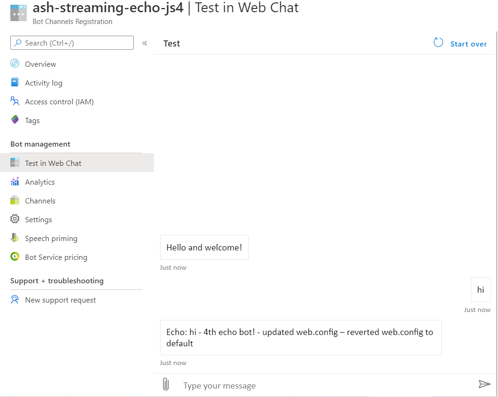
* In contrast, navigating to `/.bot/`, you no longer get the DL ASE JSON response:
    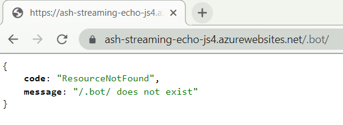
